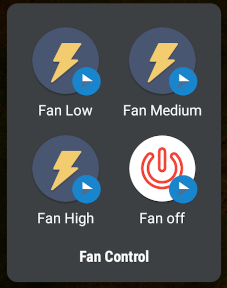
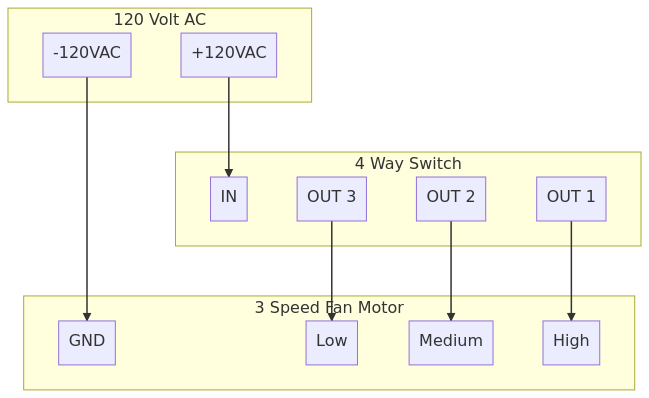
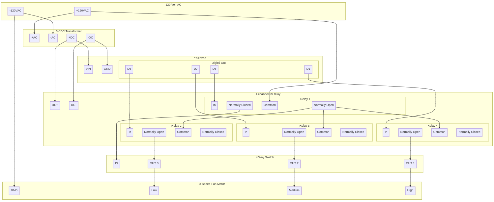

# ESP8266 Remote Fan Relay

Convert a manual four-way switched fan to remote WiFi control using a four
channel relay.

## Directions

1. Setup [PlatformIO](https://platformio.org/)
2. Copy the `src/credentials.h.example` file to `src/credentials.h`.
3. Add the WiFi SSID and password to `src/credentials.h`.
4. Test the network connection and confirm the web form appears on port 80.
5. Now "just" assemble the hardware and install fit in your fan. YMMV depending
   on device. In this case, the fan has been wired so the manual control works
   as a failsafe when the power relay is unpowered.
6. Done? Now control your fan with:
   * The HTML form
   * [OpenHAB HTTP binding](https://v2.openhab.org/addons/bindings/http1/)
   * [Home Assitant RESTful Command integration](https://www.home-assistant.io/integrations/rest_command/)
   * Android - [HTTP Request Shortcuts](https://play.google.com/store/apps/details?id=ch.rmy.android.http_shortcuts&hl=en_US&gl=US)

### Android HTTP Request Shortcuts Example 

Create in-app shortcuts `GET` requests to the following URLS:
* `http://device-ip-address/?speed=off`
* `http://device-ip-address/?speed=low`
* `http://device-ip-address/?speed=medium`
* `http://device-ip-address/?speed=high`

Enables creation of a Homescreen folder of fan control shortcuts:

[](android-fan-control.png)

Note: Linux, Windows, MacOS, and iOS can use Zeroconf/Bonjour/mDNS `.local` domains, [only Android cannot](https://github.com/Waboodoo/HTTP-Shortcuts/issues/230) 🙄

## Parts

* A fan (or other device) with a four position switch: off, low, medium, high.
* [ESP8266 NodeMCU CP2102 ESP-12E Development Board](https://amzn.to/3tsSgZ2)
* [4 Channel 5V Relay Module](https://amzn.to/3tnwi9S)
* [120V AC to DC 5V 2A/10W Power Supply](https://amzn.to/3bbZUAH)
* Wire, Solder, Heatshrink, & Tools
* Optional: [Dustproof Weatherproof IP65 Electrical Box - Project Enclosure](https://amzn.to/3h91ZBi)

## Wiring

### Before

[](mermaidjs-fan-before.png)

<details>
  <summary>MermaidJS Source</summary>

```mermaidjs
graph TB
    subgraph 120V[120 Volt AC]
        +120[+120VAC]
        -120[-120VAC]
    end

    subgraph S[4 Way Switch]
        S-IN[IN]
        S-OUT1[OUT 1]
        S-OUT2[OUT 2]
        S-OUT3[OUT 3]
    end

    subgraph M[3 Speed Fan Motor]
        M-GND[GND]
        M-LOW[Low]
        M-MED[Medium]
        M-HIGH[High]
    end

    -120-->M-GND
    +120-->S-IN
    S-OUT1-->M-HIGH
    S-OUT2-->M-MED
    S-OUT3-->M-LOW
```

</details>

### After

[](mermaidjs-fan-after.png)

<details>
  <summary>MermaidJS Source</summary>

```mermaidjs
graph TB
    subgraph 120V[120 Volt AC]
        +120[+120VAC]
        -120[-120VAC]
    end

    subgraph S[4 Way Switch]
        S-IN[IN]
        S-OUT1[OUT 1]
        S-OUT2[OUT 2]
        S-OUT3[OUT 3]
    end

    subgraph M[3 Speed Fan Motor]
        M-GND[GND]
        M-LOW[Low]
        M-MED[Medium]
        M-HIGH[High]
    end

    subgraph T[5V DC Transformer]
        T+120[+AC]
        T-120[-AC]
        T+5[+DC]
        T-5[-DC]
    end

    subgraph ESP[ESP8266]
        VIN
        GND
        subgraph D[Digital Out]
            D1
            D5
            D6
            D7
        end
    end

    subgraph R[4 channel 5V relay]
        DC+
        DC-
        subgraph R1[Relay 1]
            IN1[In]
            NO1[Normally Open]
            COM1[Common]
            NC1[Normally Closed]
        end
        subgraph R2[Relay 2]
            IN2[In]
            NO2[Normally Open]
            COM2[Common]
            NC2[Normally Closed]
        end
        subgraph R3[Relay 3]
            IN3[In]
            NO3[Normally Open]
            COM3[Common]
            NC3[Normally Closed]
        end
        subgraph R4[Relay 4]
            IN4[In]
            NO4[Normally Open]
            COM4[Common]
            NC4[Normally Closed]
        end
    end
    
    %% Original Wiring
    -120-->M-GND
    S-OUT1-->M-HIGH
    S-OUT2-->M-MED
    S-OUT3-->M-LOW

    +120-->T+120
    -120-->T-120
    +120-->COM1
  
    T+5-->VIN
    T-5-->GND
    T+5-->DC+
    T-5-->DC-

    D5-->IN1
    D6-->IN2
    D7-->IN3
    D1-->IN4

    %% Stock switch powered when relay is unpowered
    NC1-->S-IN
    %% Relays 2,3,4 powered by relay 1
    NO1-->COM2
    NO1-->COM3
    NO1-->COM4

    NO2-->S-OUT3
    NO3-->S-OUT2
    NO4-->S-OUT1
```

</details>

## Background

I have a HEPA filter in an out-of-the-way, but awkward to access location.
Problem, solved.

## License

MIT
